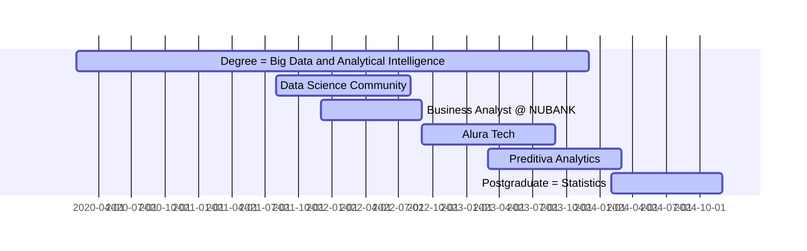

## Who I'm?

I am a Data Scientist Graduated in Big Data and Analytical Intelligence studying PostGraduate course in Statistics, 
I like to work on problem solving, prioritizing fast deliveries to build solutions that help in decision making and generate profit, 
I believe that my +10 years of experience in the Automotive Industry contribute to innovative ideas and different thoughts!

I currently dedicate my studies to Data Science, and I created this portfolio with the aim of demonstrating the development of my skills.

## My Journey w/ Data

## Main Skills Developed on Journey
| Skill                           | Tool |
|---------------------------------|------|
| Planning and Management         |    |
| Programming and Query Languages |    |
| Libraries and Frameworks        |    |
| Data Analysis                   |    |
| Machine Learning                |    |
| DataViz                         |   |

## Featured Projects to Demonstrate Skills
| Project Link | Business Problem | Method |
|--------------|------------------|:------:|
| [house_rocket](https://github.com/pmusachio/house_rocket) | Identification of Properties for Purchase and definition of the Resale Price | **EDA** |
| [rossmann_sales_predction](https://github.com/pmusachio/rossmann_store_sales_prediction) | The CFO needs to plan store renovations, for this the budget needs to be aligned with the sales of each store | **Regression** |
| [health_insurance_cross-Sell]() | A Health Insurance company needs to Detect Customers who are most Likely to Purchase Auto Insurance | **Classification** |
| [insiders_loyalty_program](https://github.com/pmusachio/high_value_customer_identification) | Determine which are the Most Valuable customers to form the "INSIDERS" Loyalty Program, with the aim of Increasing Revenue and Purchase Frequency | **Clustering** |

## Contacts

