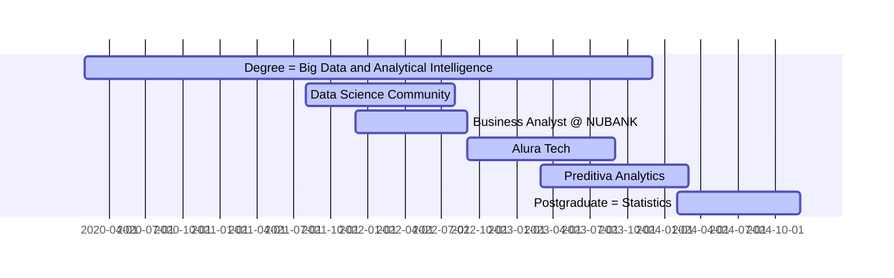

## Who I'm?
I am a Data Scientist graduated in Big Data and Analytical Intelligence studying graduate course in Statistics, 
I like to work on problem solving, prioritizing fast deliveries to build solutions that help in decision making and generate profit, 
I believe that my +10 years of experience in the Automotive Industry contribute to innovative ideas and different thoughts!

I currently dedicate my studies to Data Science, and I created this portfolio with the aim of demonstrating the development of my skills.

## My Journey w/ Data

## Main Skills Developed on Journey
| Skill                           | Tool                                                      |
|---------------------------------|-----------------------------------------------------------|
| Planning and Management         | CRISP-DM, Scrum, Jira                                     |
| Programming and Query Languages | Python, Scala, SQL                                        |
| Libraries and Frameworks        | Pandas, NumPy, Scikit-Learn                               |
| Data Analysis                   | Statistics, Exploration, Predictive Modeling, Time Series |
| Machine Learning                | Regression, Classification, Clustering                    |
| DataViz                         | Matplotlib, Seaborn, StreamLit                            |

## Featured Projects to Demonstrate Skills
| Project Link | Business Problem | Solution | Results |
|--------------|------------------|----------|---------|
| [House Rocket](https://github.com/pmusachio/house_rocket) | Identification of Properties for Purchase and definition of the Resale Price | EDA | Total Profit (sale - purchase) of the Properties in Portfolio will be: **$1,120,337,411.00** |
| [Rossmann Sales Predction](https://github.com/pmusachio/rossmann_store_sales_prediction) | The CFO needs to plan store renovations, for this the budget needs to be aligned with the sales of each store | Regression | Accumulated Sales of all Stores for the next 6w = **$287,038,880.00** |
| [Health Insurance Cross-Sell]() | A Health Insurance company needs to Detect Customers who are most Likely to Purchase Auto Insurance | Classification |  |
| [INSIDERS Loyalty Program](https://github.com/pmusachio/high_value_customer_identification) | Determine which are the Most Valuable customers to form the "INSIDERS" Loyalty Program, with the aim of Increasing Revenue and Purchase Frequency | Clustering |  |

## Contacts

